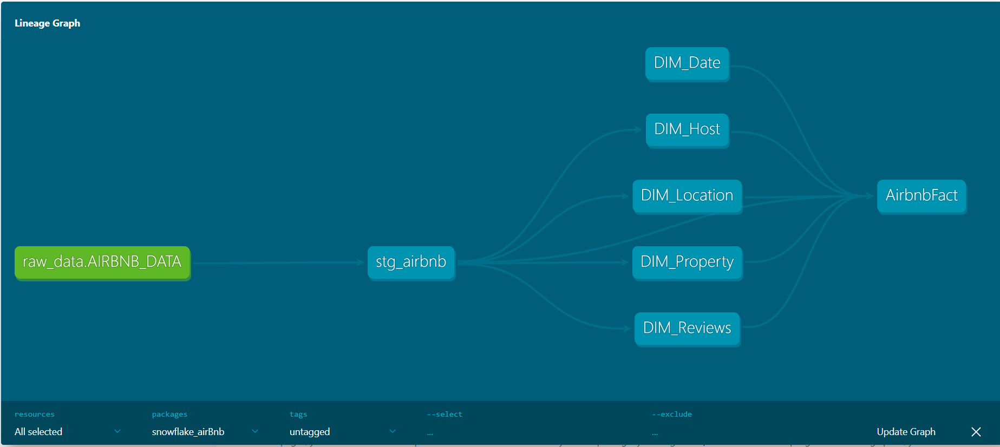
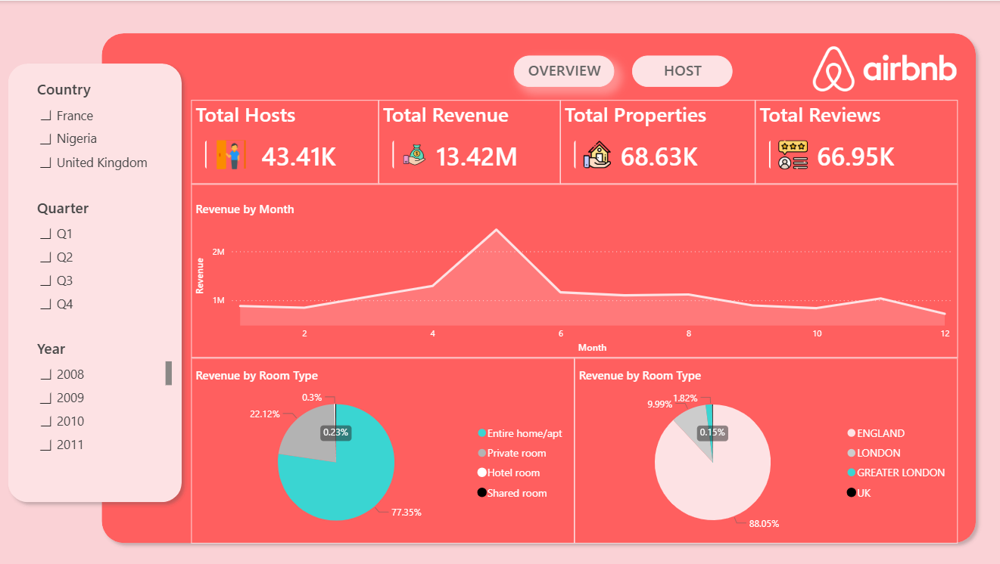
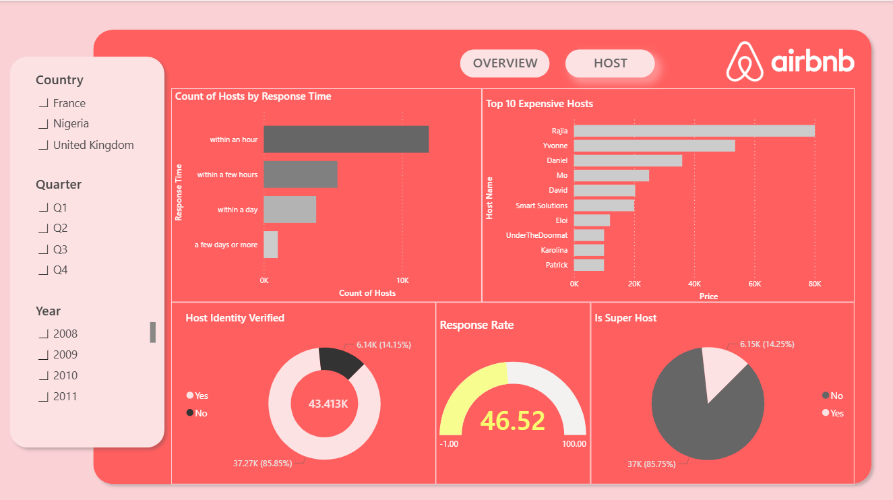

# 🏠 AirBnB Data Transformation ELT 
# ❄️ dbt + Snowflake ❄️

This project focuses on building a robust Data Warehouse layer for AirBnB data using **dbt (data build tool)** and **Snowflake**. It transforms raw data into a structured **Star Schema** to enable efficient analytics and reporting.

---

## 🚀 Project Overview
The goal of this project is to implement an ELT (Extract, Load, Transform) pipeline where:
- **Raw Data** is stored in Snowflake.
- **Transformations** are handled by dbt.
- **Data Modeling** follows best practices (Staging, Dimensions, and Fact tables).

## 🛠 Tech Stack
- **Data Warehouse:** Snowflake
- **Transformation Tool:** dbt Core (v1.11.8)
- **Environment:** Python Virtual Environment (dbt-env)
- **Source Control:** Git & GitHub

## 🏗 Data Architecture & Modeling
The project is organized into several layers:

1. **Staging Layer (`models/staging`):** - Initial cleaning, renaming, and type casting of raw AirBnB data.
2. **Core Layer (Mart):**
   - **Dimension Tables:** `DIM_Host`, `DIM_Location`, `DIM_Property`, `DIM_Date`, and `DIM_Reviews`.
   - **Fact Table:** `AirbnbFact` containing measurable data and foreign keys to dimensions.
## 📊 Visualization & Insights
Here is the data lineage and the final dashboard created in Power BI:

### Data Lineage

### Power BI Dashboard

## 📊 Key Features
- **Data Lineage:** Full traceability from raw source to final fact table.
- **Tests:** Implementation of generic dbt tests (Unique, Not Null) to ensure data quality.
- **Documentation:** Automated documentation generated using dbt.

